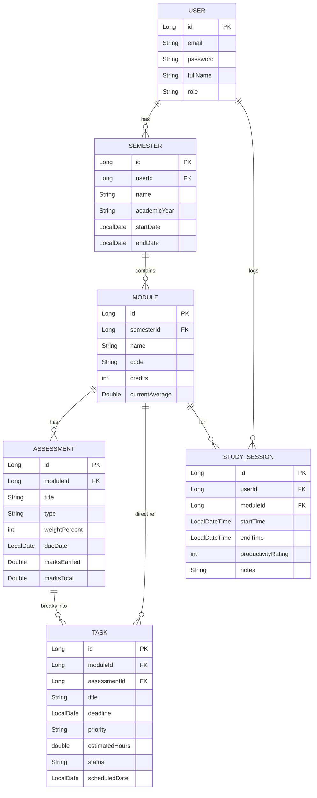

# 📚 Academic Planner — Intelligent Study Management System


> A production-grade fullstack academic management platform built with Spring Boot. Goes beyond basic CRUD features an intelligent scheduling engine, workload balancing algorithms, automated performance tracking, and rule-based analytics insights. Designed to simulate real-world software engineering challenges and demonstrate advanced backend architecture.

---

## 📌 Table of Contents

- [Overview](#-overview)
- [Why This Project Stands Out](#-why-this-project-stands-out)
- [Features](#-features)
- [Tech Stack](#-tech-stack)
- [System Architecture](#-system-architecture)
- [Database Design](#-database-design)
- [API Reference](#-api-reference)
- [Scheduling Engine — Deep Dive](#-scheduling-engine--deep-dive)
- [Analytics Engine](#-analytics-engine)
- [Security Implementation](#-security-implementation)
- [Getting Started](#-getting-started)
- [Project Structure](#-project-structure)
- [Design Decisions](#-design-decisions)
- [Roadmap](#-roadmap)
- [Author](#-author)

---

## 🧭 Overview

The Academic Planner is a fullstack web application that helps students manage their academic workload intelligently. Unlike basic task managers, this system models the full academic hierarchy — from years down to individual tasks — and uses a priority-based scheduling engine to automatically distribute work across available days while respecting daily capacity limits.

The backend is fully built and tested. A React frontend is planned as the next phase.

**Problem it solves:** Students juggle multiple modules, overlapping deadlines, and unpredictable workloads. Existing tools treat all tasks equally. This system understands academic context — weight, priority, module balance, and deadline proximity — to give students an optimised study plan, not just a list.

---

## 🏆 Why This Project Stands Out

This is not a to-do list with a database. Here is what makes it different:

**1. Real scheduling logic, not fake AI.**
The scheduling engine scores every task using a formula that combines deadline urgency, academic weight, and priority level. Tasks are distributed greedily across days respecting a configurable daily hour cap. The algorithm is deterministic, explainable, and re-runs adaptively when the academic situation changes.

**2. Proper academic data modelling.**
Most student projects use flat tables. This system models the full academic hierarchy: `User → Semester → Module → Assessment → Task`. This reflects how universities actually work and produces a far richer dataset for analytics.

**3. Automated performance tracking.**
When a student marks an assessment, the system immediately recalculates the module's weighted average. Semester performance trends are tracked across time — not just stored.

**4. Rule-based insight generation.**
The analytics engine generates natural-language insights: deadlines at risk, modules with no study time logged, overdue task accumulation. These are produced from rule-based logic — no ML library needed, no black box, fully explainable.

**5. Background job automation.**
Scheduled cron jobs run at midnight to auto-flag overdue tasks, and every morning to dispatch deadline reminder emails — all without any user action.

**6. Security done properly.**
JWT-based stateless authentication, BCrypt password hashing, role-based access control, and a `UserDetailsService` implementation fully decoupled from the security config to avoid circular dependency issues.

---

## ✨ Features

### Core
- ✅ JWT authentication (register, login, stateless sessions)
- ✅ Full academic hierarchy management (Semester → Module → Assessment → Task)
- ✅ Task CRUD with priority, status tracking, and deadline management
- ✅ Assessment marking with automatic weighted module average calculation
- ✅ Study session logging with productivity ratings

### Intelligent Scheduling
- ✅ Automatic 14-day study plan generation
- ✅ Priority scoring: `score = (1 / daysUntilDeadline) × priorityWeight`
- ✅ Daily hour cap enforcement (default: 6 hours/day)
- ✅ Adaptive rescheduling — re-run the engine any time tasks change
- ✅ Weekly schedule view endpoint for calendar integration

### Automation & Notifications
- ✅ Midnight cron job: auto-marks past-deadline tasks as `OVERDUE`
- ✅ Morning cron job: sends email reminders for tasks due in 1, 3, and 7 days
- ✅ JavaMailSender integration with SMTP support

### Analytics & Insights
- ✅ Completion rate tracking across all modules
- ✅ Study hours and productivity averages per module
- ✅ Rule-based insight generation (at-risk tasks, neglected modules, overload warnings)
- ✅ Designed for easy dashboard integration

---

## 🛠 Tech Stack

| Layer | Technology | Purpose |
|---|---|---|
| Language | Java 21 | Latest LTS with records and pattern matching |
| Framework | Spring Boot 4.0.6 | Web, Security, JPA, Mail, Scheduling |
| Database | PostgreSQL 16 | Primary relational store |
| ORM | Hibernate 7 / Spring Data JPA | Entity management and JPQL queries |
| Security | Spring Security + JJWT 0.11.5 | Stateless JWT authentication |
| Docs | SpringDoc OpenAPI 2.8.8 | Swagger UI auto-generation |
| Build | Maven | Dependency management and packaging |
| Java Utils | Lombok | Boilerplate reduction |

---

## 🏗 System Architecture

The system follows a clean four-layer architecture with strict separation of concerns:

```
┌─────────────────────────────────────────────────────────────┐
│              React Frontend (future phase)                   │
└──────────────────────────┬──────────────────────────────────┘
                           │ HTTP / REST / JSON
┌──────────────────────────▼──────────────────────────────────┐
│     JWT Security Filter · BCrypt · Role-Based Access         │
└──────────────────────────┬──────────────────────────────────┘
                           │
┌──────────────────────────▼──────────────────────────────────┐
│                    CONTROLLER LAYER                          │
│  AuthController · SemesterController · ModuleController      │
│  AssessmentController · TaskController · ScheduleController  │
│  StudySessionController · AnalyticsController                │
└──────────────────────────┬──────────────────────────────────┘
                           │
┌──────────────────────────▼──────────────────────────────────┐
│                     SERVICE LAYER                            │
│  AuthService · SemesterService · ModuleService               │
│  AssessmentService · TaskService · ScheduleService           │
│  StudySessionService · AnalyticsService · NotificationService│
└──────────────────────────┬──────────────────────────────────┘
                           │
┌──────────────────────────▼──────────────────────────────────┐
│                   REPOSITORY LAYER                           │
│  UserRepository · SemesterRepository · ModuleRepository      │
│  AssessmentRepository · TaskRepository · StudySessionRepository│
└──────────────────────────┬──────────────────────────────────┘
                           │
┌──────────────────────────▼──────────────────────────────────┐
│              PostgreSQL 16 — academic_planner                 │
└─────────────────────────────────────────────────────────────┘
```

**Design principles applied:**
- SOLID principles throughout — single responsibility per service, open/closed via enums, dependency inversion via constructor injection
- DTO pattern (Java records) for all inbound request data
- `@Transactional` on all write operations
- Ownership validation on every endpoint — users can only access their own data
- Global exception handler returns consistent JSON error responses

---

## 🗄 Database Design

### Entity Relationship Diagram



### Key Design Decisions

**Why `Module → Task` direct FK in addition to `Assessment → Task`?**
Assessments are optional. A student can create a standalone task against a module without it belonging to a formal assessment (e.g. "Read lecture slides"). The direct `moduleId` FK on Task enables fast querying by module without joining through assessments.

**Why store `currentAverage` on Module?**
Denormalisation by design. Recalculating the weighted average on every read would require joining assessments on every module fetch. Instead, `AssessmentService` updates the average synchronously whenever marks are recorded. This trades a small write overhead for fast read performance — correct for a dashboard use case.

**Why `scheduledDate` on Task?**
The scheduling engine assigns tasks to specific dates and persists this on the task itself. This avoids building a separate `schedule_entries` table and keeps the weekly view query simple.

---

## 📡 API Reference

All endpoints except `/api/auth/**` require:
```
Authorization: Bearer <jwt_token>
```

Full interactive documentation available at: `http://localhost:8080/swagger-ui/index.html`

### Authentication

| Method | Endpoint | Description | Auth Required |
|---|---|---|---|
| POST | `/api/auth/register` | Register new student | No |
| POST | `/api/auth/login` | Login, returns JWT | No |

**Register request:**
```json
{
  "email": "student@university.ac.za",
  "password": "securepassword",
  "fullName": "Jane Doe"
}
```

**Login response:**
```json
{
  "token": "eyJhbGciOiJIUzI1NiJ9...",
  "email": "student@university.ac.za",
  "fullName": "Jane Doe"
}
```

---

### Academic Structure

| Method | Endpoint | Description |
|---|---|---|
| GET | `/api/semesters` | Get all semesters for current user |
| POST | `/api/semesters` | Create a semester |
| PUT | `/api/semesters/{id}` | Update a semester |
| DELETE | `/api/semesters/{id}` | Delete a semester |
| GET | `/api/modules?semesterId=` | Get modules (optionally filtered) |
| POST | `/api/modules` | Create a module |
| PUT | `/api/modules/{id}` | Update a module |
| DELETE | `/api/modules/{id}` | Delete a module |
| GET | `/api/assessments?moduleId=` | Get assessments for a module |
| POST | `/api/assessments` | Create an assessment |
| PATCH | `/api/assessments/{id}/mark` | Record marks (auto-recalculates module average) |
| DELETE | `/api/assessments/{id}` | Delete an assessment |

---

### Task Management

| Method | Endpoint | Description |
|---|---|---|
| GET | `/api/tasks?moduleId=&status=` | Get tasks with optional filters |
| POST | `/api/tasks` | Create a task |
| PUT | `/api/tasks/{id}` | Update a task |
| PATCH | `/api/tasks/{id}/status` | Update task status only |
| DELETE | `/api/tasks/{id}` | Delete a task |

**Task statuses:** `TODO` → `IN_PROGRESS` → `COMPLETED` (or auto-set to `OVERDUE` by cron)

**Task priorities:** `LOW`, `MEDIUM`, `HIGH`

---

### Scheduling

| Method | Endpoint | Description |
|---|---|---|
| POST | `/api/schedule/generate` | Run the scheduling engine (14-day horizon) |
| GET | `/api/schedule/weekly` | View this week's scheduled tasks |

---

### Study Sessions & Analytics

| Method | Endpoint | Description |
|---|---|---|
| GET | `/api/study-sessions?moduleId=` | Get logged sessions |
| POST | `/api/study-sessions` | Log a study session |
| DELETE | `/api/study-sessions/{id}` | Delete a session |
| GET | `/api/analytics/overview` | Full analytics overview with insights |

**Analytics response:**
```json
{
  "totalTasks": 12,
  "completedTasks": 7,
  "overdueTasks": 1,
  "upcomingTasks": 4,
  "completionRate": 58,
  "studyHoursPerModule": {
    "1": 6.5,
    "2": 2.0,
    "3": 0.0
  },
  "avgProductivityPerModule": {
    "1": 4.2,
    "2": 3.8
  },
  "insights": [
    "You have 2 task(s) due within the next 3 days.",
    "No study time logged for Algorithms — it has open tasks."
  ]
}
```

---

## ⚙️ Scheduling Engine — Deep Dive

The scheduling engine is the most technically significant component of this system. It lives in `ScheduleService.generateWeeklySchedule()`.

### Algorithm

```
Input:  All pending tasks due within the next 14 days
Output: Map<LocalDate, List<Task>> — each day mapped to its assigned tasks

1. Fetch pending tasks (status ≠ COMPLETED) due within [today, today+14]
2. Score each task:

        score = (1 / daysUntilDeadline) × priorityWeight

   where priorityWeight = HIGH→3.0, MEDIUM→2.0, LOW→1.0

3. Sort tasks by score descending (most urgent first)
4. For each task, find the earliest day with remaining capacity:
   - remaining = MAX_HOURS_PER_DAY(6.0) - hoursAlreadyScheduled(day)
   - if remaining >= task.estimatedHours → assign to this day
   - else try the next day
   - cap at the task's own deadline

5. Persist scheduledDate on each task
6. Return the full schedule map
```

### Why this scoring formula?

The formula `1/daysLeft × priority` elegantly captures two competing concerns:

- A task due **tomorrow** with LOW priority scores higher than a task due **next week** with HIGH priority — urgency wins when time is short.
- Between two tasks with equal deadlines, the HIGH priority task is always scheduled first.
- The `1/daysLeft` term naturally accelerates as deadlines approach, creating organic urgency without any threshold logic.

### Adaptive behaviour

The engine is stateless — it does not remember previous runs. Call `POST /api/schedule/generate` any time the academic situation changes (new task added, task completed, deadline updated) and it produces a fresh optimal plan from the current state.

### Configuration

```properties
# Configurable constants in ScheduleService
MAX_HOURS_PER_DAY = 6.0       # Maximum study hours per day
SCHEDULE_AHEAD_DAYS = 14      # Planning horizon in days
```

---

## 📊 Analytics Engine

The analytics engine (`AnalyticsService`) generates insights from three data sources: task history, study session logs, and module performance records.

### Insight rules

| Rule | Trigger | Insight Generated |
|---|---|---|
| At-risk detection | Task due in ≤ 3 days, not completed | "You have N task(s) due within the next 3 days." |
| Overload warning | ≥ 3 overdue tasks | "You have N overdue tasks — consider rescheduling." |
| Module neglect | Open tasks exist but 0 study hours logged | "No study time logged for [Module] — it has open tasks." |
| On track | None of the above triggered | "You're on track — keep it up!" |

All insights are produced using pure Java stream operations on in-memory data — no SQL aggregations, no external dependencies.

---

## 🔐 Security Implementation

Security is implemented in three components:

**`JwtUtil`** — Generates and validates tokens using HMAC-SHA256 signing. Token expiry is configurable via `application.properties`. Extracts the subject (email) from claims for user resolution.

**`JwtFilter`** — `OncePerRequestFilter` that intercepts every request, validates the Bearer token, loads the user, and sets the `SecurityContext`. Injects `UserDetailsServiceImpl` directly (not the interface) to break the circular dependency between `JwtFilter` and `SecurityConfig`.

**`SecurityConfig`** — Defines the filter chain: CSRF disabled (stateless API), session management set to `STATELESS`, public routes whitelisted (`/api/auth/**`, `/swagger-ui/**`, `/v3/api-docs/**`), all other routes require authentication.

**Password security:** BCrypt with default cost factor 10. Passwords are never stored or returned in plaintext. `@JsonIgnore` on the password field prevents accidental serialisation.

---

## 🚀 Getting Started

### Prerequisites

- Java 21+
- Maven 3.9+
- PostgreSQL 16+

### 1. Clone the repository

```bash
git clone https://github.com/yourusername/academic-planner.git
cd academic-planner
```

### 2. Create the database

```sql
CREATE DATABASE academic_planner;
```

### 3. Configure the application

Edit `src/main/resources/application.properties`:

```properties
# Database
spring.datasource.url=jdbc:postgresql://localhost:5432/academic_planner
spring.datasource.username=postgres
spring.datasource.password=YOUR_PASSWORD

# JWT — use a strong secret (min 32 characters)
jwt.secret=your-very-long-and-secure-secret-key-here
jwt.expiration=86400000

# Mail (optional — notifications won't fire if omitted)
spring.mail.host=smtp.gmail.com
spring.mail.port=587
spring.mail.username=your-email@gmail.com
spring.mail.password=your-app-password
```

### 4. Build and run

```bash
mvn spring-boot:run
```

The application starts on `http://localhost:8080`.

### 5. Explore the API

Open Swagger UI: **http://localhost:8080/swagger-ui/index.html**

---

### Quick test with curl

```bash
# Register
curl -X POST http://localhost:8080/api/auth/register \
  -H "Content-Type: application/json" \
  -d '{"email":"you@university.ac.za","password":"password123","fullName":"Your Name"}'

# Login and save token
TOKEN=$(curl -s -X POST http://localhost:8080/api/auth/login \
  -H "Content-Type: application/json" \
  -d '{"email":"you@university.ac.za","password":"password123"}' \
  | grep -o '"token":"[^"]*' | cut -d'"' -f4)

# Create a semester
curl -X POST http://localhost:8080/api/semesters \
  -H "Authorization: Bearer $TOKEN" \
  -H "Content-Type: application/json" \
  -d '{"name":"Semester 1","academicYear":"2026","startDate":"2026-02-01","endDate":"2026-06-30"}'

# Run the scheduling engine
curl -X POST http://localhost:8080/api/schedule/generate \
  -H "Authorization: Bearer $TOKEN"
```

---

## 📁 Project Structure

```
src/main/java/az/ac/mycput/
│
├── AcademicPlannerApplication.java      # Entry point, @EnableScheduling
│
├── config/
│   ├── SecurityConfig.java              # Filter chain, BCrypt bean
│   ├── UserDetailsServiceImpl.java      # Loads user by email
│   ├── JwtFilter.java                   # Token validation per request
│   ├── JwtUtil.java                     # Token generation and parsing
│   ├── CurrentUser.java                 # Helper — resolves auth user
│   ├── GlobalExceptionHandler.java      # Unified JSON error responses
│   └── SwaggerConfig.java               # OpenAPI + JWT security scheme
│
├── entity/
│   ├── User.java                        # Student account
│   ├── Semester.java                    # Academic period
│   ├── Module.java                      # Course/subject
│   ├── Assessment.java                  # Assignment, test, exam
│   ├── Task.java                        # Granular study task
│   └── StudySession.java                # Logged study time
│
├── repository/
│   ├── UserRepository.java
│   ├── SemesterRepository.java
│   ├── ModuleRepository.java
│   ├── AssessmentRepository.java
│   ├── TaskRepository.java              # Custom JPQL: pending tasks, overdue
│   └── StudySessionRepository.java
│
├── service/
│   ├── AuthService.java                 # Register, login
│   ├── SemesterService.java
│   ├── ModuleService.java
│   ├── AssessmentService.java           # Marks + weighted average recalc
│   ├── TaskService.java                 # CRUD + ownership validation
│   ├── ScheduleService.java             # ⭐ Scheduling engine
│   ├── StudySessionService.java
│   ├── AnalyticsService.java            # ⭐ Rule-based insights
│   └── NotificationService.java         # Cron jobs + email reminders
│
├── controller/
│   ├── AuthController.java
│   ├── SemesterController.java
│   ├── ModuleController.java
│   ├── AssessmentController.java
│   ├── TaskController.java
│   ├── ScheduleController.java
│   ├── StudySessionController.java
│   └── AnalyticsController.java
│
└── dto/
    └── AppDTOs.java                     # Java records for all requests
```

---

## 💡 Design Decisions

**Java records for DTOs instead of Lombok `@Data`**
Java 21 records are immutable by default, require no annotation processing, and communicate intent clearly — these objects carry data, nothing else. This is idiomatic modern Java.

**Ownership validation in services, not repositories**
Every service method that reads or writes data first verifies that the requested entity belongs to the authenticated user. This is enforced at the service layer (not via query filters) so the logic is explicit, testable, and easy to audit.

**`@JsonIgnore` on bidirectional relationships**
All `@ManyToOne` back-references are annotated with `@JsonIgnore`. This prevents Jackson infinite-recursion during serialisation and keeps API responses lean — clients receive the entity they asked for, not the entire object graph.

**Scheduling computed in Java, not SQL**
The hours-per-module analytics query was originally written as a JPQL `EXTRACT(EPOCH FROM ...)` expression — which Hibernate 7 rejects because it treats `LocalDateTime` subtraction as a `Duration` type, not a `TEMPORAL`. The fix moves the computation to Java streams, which is more readable, debuggable, and ORM-version independent.

**Notification failures are non-fatal**
The `NotificationService` wraps every mail send in a `try/catch` and logs a warning on failure. A misconfigured SMTP server should never crash the application or fail a scheduled task that has broader effects (like marking overdue tasks).

---

## 🗺 Roadmap

### Phase 2 — React Frontend (Planned)
- [ ] Dashboard with analytics cards and insight feed
- [ ] Interactive weekly calendar with drag-and-drop rescheduling
- [ ] Module performance charts (Chart.js / Recharts)
- [ ] Task management screen with filters and bulk actions
- [ ] Study session timer with auto-log on stop

### Phase 3 — Enhancements
- [ ] PDF study plan export
- [ ] Semester comparison (GPA trends across years)
- [ ] Push notifications (WebSocket or Firebase)
- [ ] Docker Compose setup for one-command deployment
- [ ] Unit and integration test suite (JUnit 5 + Mockito + Testcontainers)

---

## 👤 Author

**Samkelo**
Final Year Software Engineering Student

> This project was built as a final year portfolio piece to demonstrate production quality Spring Boot architecture, intelligent algorithm design, and real-world system thinking beyond the scope of standard academic projects.

---

## 📄 License

This project is open source and available under the [MIT License](LICENSE).
